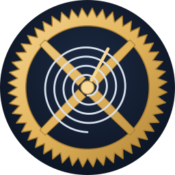
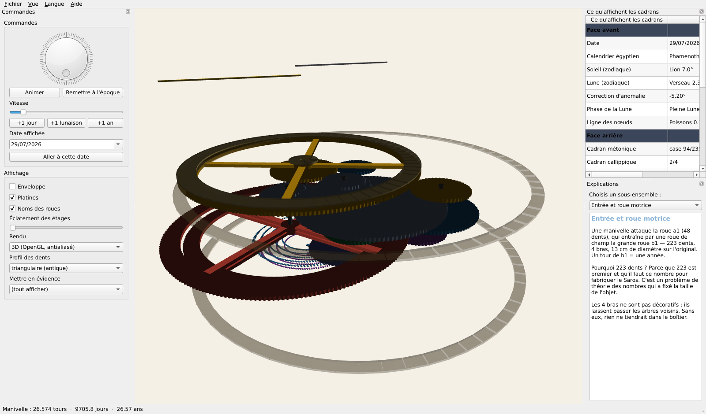
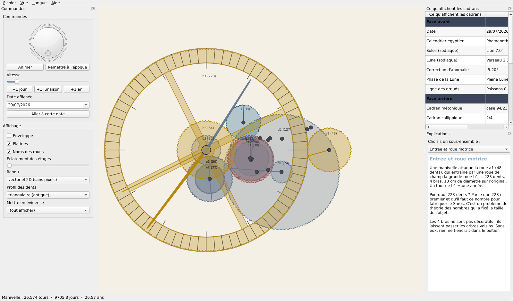

<p align="center">
  
</p>

# Anticythere3D — simulateur de la machine d'Anticythère

*[English version below](#anticythere3d--antikythera-mechanism-simulator)*

Un simulateur 3D **fonctionnel** de la machine d'Anticythère : on tourne la
manivelle, les 33 roues tournent, et tous les cadrans affichent ce que lisait
son propriétaire il y a 2 100 ans. L'enveloppe se retire pour voir le mécanisme,
et chaque sous-ensemble est expliqué dans l'application.

Interface **bilingue français / anglais**, commutable à chaud.

Deux rendus au choix : **3D** temps réel (fond clair, antialiasing 8×) et
**vectoriel 2D**, en courbes, exportable en SVG / PDF — sans aucun pixel.




---

## Installation

### Le plus simple : l'exécutable

Va sur la [page des versions](https://github.com/ARP273-ROSE/Anticythere3D/releases/latest),
télécharge `Anticythere3D-windows.exe` et double-clique. Rien à installer.
Ensuite, le programme se met à jour tout seul : **Aide → Rechercher une mise à jour**.

### Sous Windows, depuis les sources

Double-clique sur **`launch.bat`** : il crée l'environnement, installe les
dépendances et démarre le simulateur. S'il y a une erreur, il l'affiche au lieu
de se fermer.

### En ligne de commande

Il suffit d'avoir **Python 3.10 ou plus récent** :

```bash
python run.py
```

Au premier lancement, le programme détecte ce qui manque et l'installe
lui-même, **3D comprise** (`PyQt6`, `numpy`, `pyqtgraph`, `PyOpenGL`), puis
redémarre pour les charger. Hors environnement virtuel il installe avec
`--user` : rien n'est écrit dans les paquets système.

```bash
python run.py --check        # liste ce qui manque, n'installe rien
python run.py --no-install   # démarre sans rien installer
python run.py --lang en      # interface en anglais
python run.py --vector       # démarre en rendu vectoriel
python run.py --samples 16   # antialiasing plus poussé (défaut : 8)
```

Si tu préfères un environnement isolé, la voie classique marche aussi :

```bash
python -m venv .venv
source .venv/bin/activate        # Windows : .venv\Scripts\activate
pip install -r requirements.txt
python run.py
```

**Sous Linux**, Qt réclame en plus quelques bibliothèques système. Leur absence
ne lève pas d'exception, elle tue le processus — le programme le détecte donc
dans un sous-processus isolé et affiche la commande exacte à lancer
(`apt`, `dnf` ou `pacman` selon la distribution). Sous Windows et macOS,
rien à faire : les binaires PyQt6 embarquent tout.

**Si OpenGL n'est pas disponible**, l'application bascule automatiquement sur le
rendu vectoriel, qui montre les mêmes rotations — elle ne plante pas.

📖 **Manuel complet illustré** : [`docs/Manuel.pdf`](docs/Manuel.pdf) (9 pages, FR + EN).

## Ce que fait le programme

| Fonction | Détail |
|---|---|
| **Manivelle** | La seule entrée de la machine, comme sur l'original. Un tour = une année. Bouton rotatif, pas à pas (+1 jour / +1 lunaison / +1 an), animation continue à vitesse réglable, ou saisie directe d'une date. |
| **Vue 3D** | Fond clair, antialiasing 8×. Rotation, zoom, vues avant / arrière / trois-quarts. Les 33 roues tournent **à leur vitesse réelle**, y compris le tenon-fente et son porte-satellite qui orbite. |
| **Retirer l'enveloppe** | Une case à cocher enlève le boîtier, une autre les platines. Le curseur *Éclatement* écarte les 16 plans d'engrènement pour montrer l'empilement. |
| **Mise en évidence** | Éteint tout sauf un sous-ensemble : entrée, Lune, anomalie, métonique, callippique, Saros, exeligmos. |
| **Profil des dents** | Bascule entre les **triangles** de la machine antique et la **développante de cercle** moderne — la différence se voit à l'écran. |
| **Report des cadrans** | Panneau détachable : date, calendrier égyptien, Soleil et Lune dans le zodiaque, correction d'anomalie, phase, ligne des nœuds, case métonique, cadran callippique, Jeux, case du Saros, correction de l'exeligmos, prédiction d'éclipse, planètes, **et l'écart entre la machine et le ciel réel**. |
| **Explications** | Un texte par sous-ensemble, avec les nombres de dents, les rapports exacts et pourquoi ils sont ce qu'ils sont. |
| **Aide** | Manuel intégré (F1), table des rapports exacts, raccourcis clavier, à propos. Tooltips bilingues partout. |
| **Rendu vectoriel** | Second mode de rendu, en courbes : dentures réelles, molette pour zoomer, glisser pour déplacer, face avant / arrière. **Aucun pixel, à n'importe quel zoom.** |
| **Export** | Capture PNG, **SVG et PDF A3 vectoriels** (aucune image bitmap à l'intérieur), export CSV des valeurs affichées. |

## Ce qui est simulé, et avec quelle exactitude

Les rapports ne sont pas approchés : ils sont calculés en **arithmétique
rationnelle exacte** (`fractions.Fraction`) à partir des nombres de dents
relevés par tomographie X.

| Sortie | Rapport exact | Contrôle |
|---|---|---|
| Lune sidérale | `254/19` | mois sidéral 27,321 266 j |
| Porte-satellite e3 | `477/4237` | 8,8826 ans (apogée lunaire : 8,8504) |
| Anomalie (tenon-fente) | — | période **27,5533 j** contre 27,554 550 : **1,8 minute d'écart** |
| Métonique | `5/19` | 5 tours en 19 ans |
| Callippique | `1/76` | 1 tour en 76 ans |
| Saros | `940/4237` | 4 tours pour 223 lunaisons |
| Exeligmos | `235/12711` | 1 tour en 54,09 ans = 3 Saros |

L'application affiche en permanence **son propre écart au ciel réel**, calculé
par éphémérides modernes (Meeus, validé contre `skyfield` : moins de 0,04° sur
la Lune, 0,015° sur le Soleil entre 1900 et 2050).

Sur la Lune, la machine dérive de quelques degrés par siècle. Ce n'est pas un
bug, et le programme le décompose : les termes d'évection et de variation ne
sont pas mécanisés (2,2°), l'approximation `254/19` dérive (3,5° par 50 ans),
et la précession de l'apogée est légèrement fausse (0,8°).

## Implantation des arbres

Les positions des 15 arbres ne sont pas dessinées à la main. Elles résultent
d'une **optimisation sous contraintes** (SageMath + scipy) imposant simultanément
les 17 entraxes exacts, la fermeture des deux boucles cinématiques, et
l'absence de collision — en tenant compte du fait que b1, e3 et e4 sont des
roues **à bras**, donc évidées. Résultat : entraxes exacts au micron, aucune
collision, encombrement 277 × 257 mm au module 1,0.

## Structure

```
anticythere/
  kinematics.py   trains, rapports exacts, tenon-fente, sorties des cadrans
  astro.py        éphémérides de référence (Meeus) et calage de la machine
  layout.py       implantation des arbres, étages, couleurs
  geometry.py     maillages 3D (roues, bras, spirales, pointeurs, boîtier)
  view3d.py       vue OpenGL (fond clair, MSAA 8x)
  view2d.py       rendu vectoriel QPainter + export SVG / PDF
  mainwindow.py   fenêtre, commandes, report des cadrans, explications, aide
  i18n.py         toutes les chaînes, FR et EN
tests/
  test_mechanism.py   10 séries de tests, exécutables sans écran
run.py
```

## Tests

```bash
python tests/test_mechanism.py
```

Vérifie les rapports contre les valeurs calculées indépendamment sous SageMath,
le mois anomalistique, le tenon-fente, le retour à l'origine de chaque cadran
après un cycle complet, les périodes planétaires, l'astronomie de référence,
le budget d'erreur, la validité des 33 maillages, les 17 entraxes, et
l'absence de chaîne non traduite.

## Sources

Toutes les données proviennent des publications primaires :

- Freeth T. *et al.*, « Decoding the ancient Greek astronomical calculator known
  as the Antikythera Mechanism », **Nature 444** (2006) 587–591 + notes
  supplémentaires (nombres de dents).
- Freeth T., Jones A., Steele J., Bitsakis Y., « Calendars with Olympiad display
  and eclipse prediction… », **Nature 454** (2008) 614–617.
- Freeth T., Higgon D., Dacanalis A., MacDonald L., Georgakopoulou M., Wojcik A.,
  « A Model of the Cosmos in the ancient Greek Antikythera Mechanism »,
  **Scientific Reports 11:5821** (2021).
- Meeus J., *Astronomical Algorithms*, 2ᵉ éd., ch. 7, 25, 47.

Ce qui relève d'une **reconstitution** et non d'un relevé — le détail des
mécanismes planétaires, l'aiguille des nœuds — est signalé comme tel dans
l'application.

---

# Anticythere3D — Antikythera Mechanism simulator

A **working** 3D simulator of the Antikythera Mechanism: turn the crank, all 33
gears turn, and every dial shows what its owner read 2,100 years ago. The case
can be removed to reveal the movement, and each subsystem is explained inside
the application. Fully **bilingual French / English**, switchable at runtime.

## Install

```bash
python -m venv .venv
source .venv/bin/activate        # Windows: .venv\Scripts\activate
pip install -r requirements.txt
python run.py --lang en
```

Python 3.10+. If OpenGL is unavailable the app falls back to an animated 2D
diagram rather than failing.

## What it does

Crank input (one turn = one year), 3D view with removable case and exploded
levels, subsystem highlighting, switch between the **ancient triangular tooth
profile** and the modern **involute**, a detachable panel reporting every dial
reading, per-subsystem explanations, built-in manual (F1), bilingual tooltips
throughout, plus a second **vector rendering mode** (real tooth outlines, wheel
to zoom, drag to pan) exporting to **SVG and A3 PDF with no bitmap inside**, and
PNG / CSV export.

## Accuracy

Gear ratios are held as **exact rationals**, from the tomography-derived tooth
counts. The pin-and-slot device, mounted on a carrier turning once per 8.8826
years, produces a modulation of period **27.5533 days** — the anomalistic month
to within **1.8 minutes**. The app continuously displays its own error against
modern ephemerides, and the test suite bounds that error by an explicit physical
budget (unmodelled evection and variation, `254/19` drift, apogee precession).

## Tests

```bash
python tests/test_mechanism.py
```

Ten test groups, all headless: exact ratios cross-checked against SageMath,
anomalistic month, pin-and-slot extremes, every dial returning to its origin
after a full cycle, planetary period relations, reference astronomy, error
budget, 33 valid meshes, 17 exact centre distances, and no untranslated string.

---

## Licence et attribution

Code écrit pour ce projet, sans emprunt. Les données scientifiques (nombres de
dents, relations de période) proviennent des publications citées plus haut et
appartiennent à leurs auteurs. Les captures d'écran de `docs/` sont produites
par le programme lui-même.
